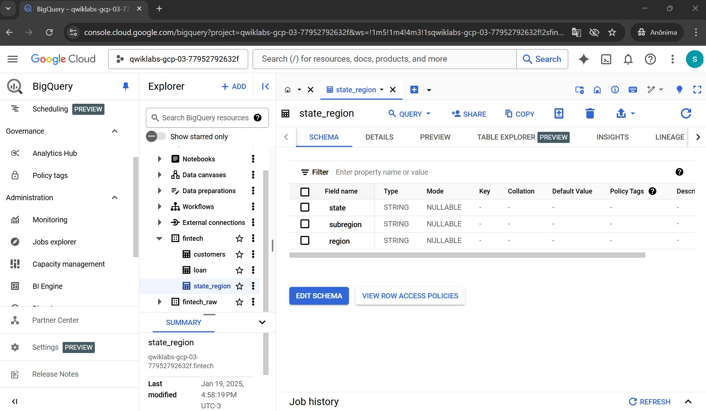
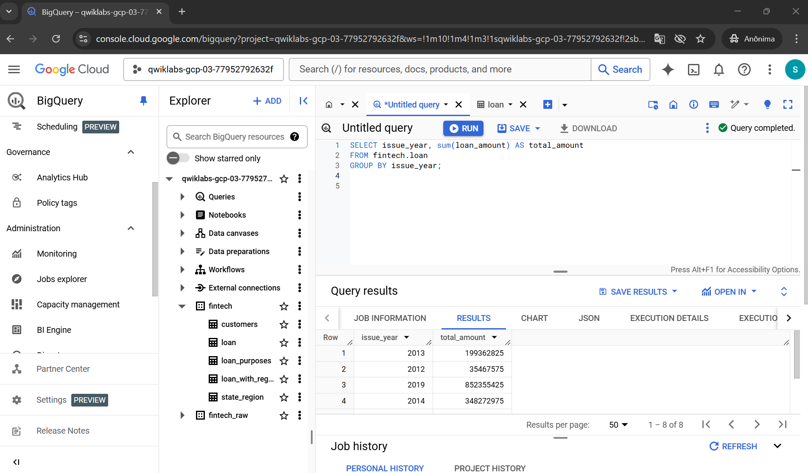
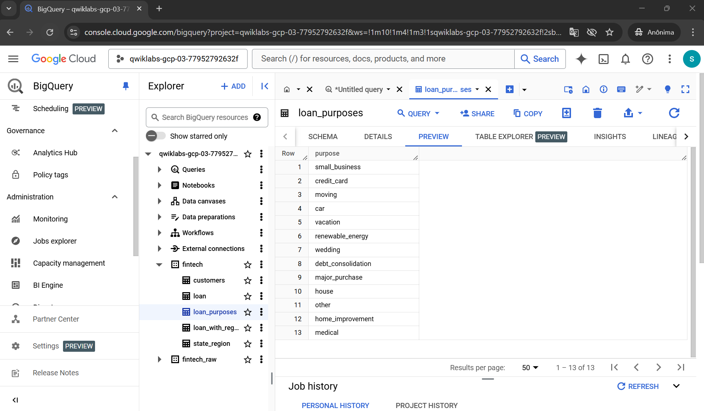
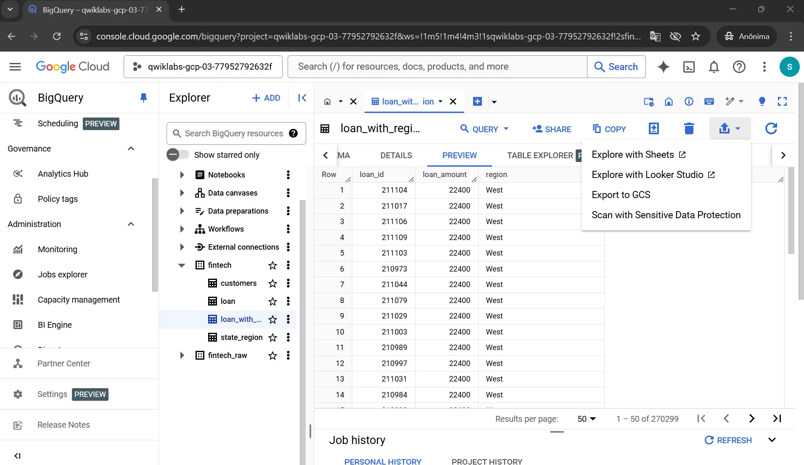
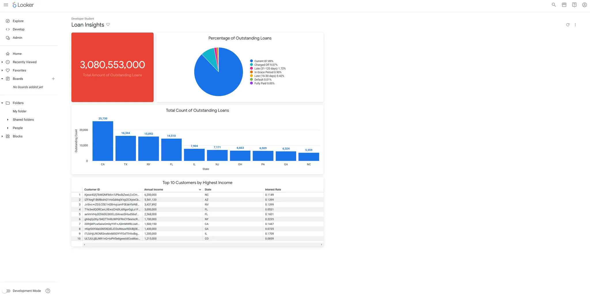

# Encontrando insights sobre empréstimos em uma Fintech utilizando análise de dados em nuvem
_Projeto Final do Google Cloud Data Analytics Certificate_

# Visão Geral: 
A equipe de dados da TheLook Fintech está desenvolvendo uma análise de dados em duas partes para ajudar a Tesouraria a analisar algumas métricas importantes, como fluxo de caixa, finalidades do empréstimo e localização do mutuário. Um dasboard e um relatório foram desenvolvidos com foco no número total de empréstimos emitidos e nas principais métricas necessárias para compreender a saúde dos empréstimos e tomar decisões.

# Entendimento do Negócio: 

TheLook Fintech é uma empresa de tecnologia financeira que oferece empréstimos a proprietários de lojas online independentes que precisam de fundos para comprar estoques. 
O objetivo do projeto de análise de dados é usar os dados de empréstimos de maneira eficaz para acompanhar o desempenho e o crescimento da empresa.
O Departamento de Tesouraria precisa:
1. Monitorar o fluxo de caixa para garantir que há saldo positivo
2. Identificar os principais motivos que levam à busca por empréstimo para direcionar suas ofertas, e
3. Rastrear os locais com maior número de pedidos de empréstimo para mitigar riscos, garantindo que os credores não dependam excessivamente de uma única área para o reembolso dos seus empréstimos.
Além disso, foi solicitado um dashboard interativo para auxiliar o time a acompanhar métricas de performance.

# Compreensão dos Dados: 

Para auxiliar o time a obter as informações, após a compreensão do problema, foi necessário explorar os dados disponíveis, selecionar quais variáveis eram relevantes e importar dados externos.
A maioria dos dados necessários para a análise são encontrados no conjunto de dados chamado _fintech_. Nele há duas tabelas, _loans_ e _customers_.


## Parte 1 ##

**1. Monitoramento do fluxo de caixa**
Para fornecer informações ao time sobre entradas e saídas de dinheiro, deve-se levar em consideraçãoo valor total do empréstimo, disponível em loan_amount, e a data na qual o empréstimo foi disponibilizado, disponível na coluna issued_date. Uma tabela com essas duas variáveis permite monitorar o fluxo de caixa por dia, mês ou ano.
A query abaixo fornece o valor total de empréstimo por ano, conforme solicitação do head do time.
```sql
SELECT issue_year, sum(loan_amount) AS total_amount
FROM fintech.loan
GROUP BY issue_year;
```


**2. Motivos para pedidos de empréstimo**
Foi descoberto pelo time que as razões pelas quais os mutuários retiram dinheiro são um forte indicador de que o dinheiro será reembolsado. Assim, para compreender quais são os principais motivos para busca por empréstimo, foi necessário trabalhar com nested data (dados aninhados) uma vez que a informação da motivação (purpose) estava na coluna aninhada _application_, advinda do processo de solicitação de empréstimo.
A query abaixo mostra a criação de uma tabela com as motivações.

```sql
CREATE TABLE fintech.loan_purposes AS
SELECT DISTINCT application.purpose
FROM fintech.loan;
```



**3. Empréstimos por região**
Para rastrear os locais com maior número de pedidos de empréstimos, foi necessário importar um arquivo CSV disponibilizado pelo departamento de Tesouraria. Esse arquivo mapeia os estados em regiões e sub-regiões.
O arquivo CSV estava localizado no Google Cloud Storage e foi importado em formato de tabela para o BigQuery por meio da seguinte query:
```sql
LOAD DATA OVERWRITE fintech.state_region
(
state string,
subregion string,
region string
)
FROM FILES (
format = 'CSV',
uris = ['gs://sureskills-lab-dev/future-workforce/da-capstone/temp_35_us/state_region_mapping/state_region_*.csv']);
```


Depois, essa tabela foi combinada com a tabela de empréstimos por meio de um JOIN, para poder segmentar o valor total de empréstimos por região, e uma nova tabela foi criada para ser explorada via Google Sheets.
A seguinte query foi utilizada:
```sql
CREATE OR REPLACE TABLE fintech.loan_with_region AS
SELECT
lo.loan_id,
lo.loan_amount,
sr.region
FROM fintech.loan lo
INNER JOIN fintech.state_region sr
ON lo.state = sr.state;
```



## Parte 2 ##

Além das respostas às questões de negócio anteriores, o time de Tesouraria precisa de um dashboard para acompanhar algumas métricas de performance. São elas:
1. Saldo total dos empréstimos pendentes: soma de todos os saldos dos empréstimos que não foram totalmente reembolsados. Os credores acompanham esse valor para compreender o risco geral e a saúde financeira. É necessário verificar facilmente se o saldo total dos empréstimos pendentes ultrapassa o limite de US$ 3.000.000.000.
2. Status do empréstimo: identifica se os pagamentos do empréstimo estão em dia, atrasados, baixados, inadimplentes, totalmente quitados ou em período de carência. Para mitigar o risco, é importante acompanhar qual porcentagem de empréstimos pendentes se enquadra em cada categoria.
3. Localização do mutuário: compreender como os empréstimos são distribuídos geograficamente por estado para mitigar os riscos de incumprimentos coletivos. Uma distribuição uniforme dos empréstimos entre regiões pode ajudar a reduzir este risco, garantindo que os credores não dependam excessivamente de qualquer área para o reembolso dos seus empréstimos.
4. Índice de renda do proprietário: é uma forma de monitorar a saúde financeira dos mutuários usando sua renda e status de propriedade da casa própria. Isto pode ajudar a influenciar outras equipas a adaptar a sua oferta financeira às necessidades dos mutuários, bem como ajudar a garantir que estão a cumprir os seus objectivos de tornar os empréstimos acessíveis a uma vasta gama de pessoas.

Assim, o dashboard foi criado no Looker, com um total de 4 visualizações:
- um valor único, com o saldo total de empréstimos pendentes, o qual sinaliza por meio da cor vermelha se o saldo pendente está acima do limite;
- um gráfico de pizza com o status do empréstimo;
- um gráfico de colunas com os 10 principais estados com a maior contagem total de empréstimos pendentes;
- uma tabela com os top 10 clientes com maiores rendas que possuem moradia própria.



O dashboard foi configurado para atualizar automaticamente de acordo com a necessidade do time.

# Conclusão: 

Os resultados da análise dos dados permitiu fornecer aos stakeholders informações valiosas para informar decisões de empréstimo, mitigar riscos e personalizar ofertas. 
Algumas recomendações e próximos passos são:
1. Obter feedback dos usuários sobre a funcionalidade e a utilidade do dashboard. Usar esse feedback para iterar e melhorar as visualizações.
2. Considerar usar a análise de dados para segmentar os mutuários com base em suas características e comportamento de empréstimo. Isso poderia ajudar a TheLook Fintech a adaptar seus produtos de empréstimo, estratégias de divulgação e comunicações para diferentes grupos de mutuários.
